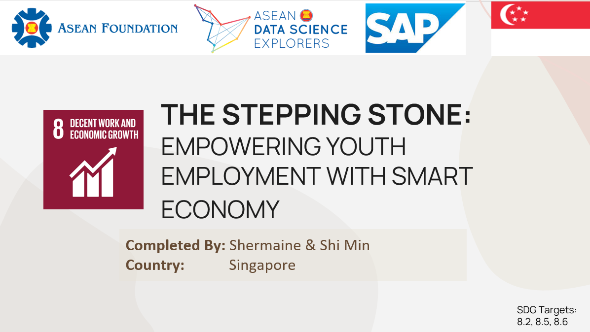

# Asean's Decent Work and Economic Growth Analytics 
- Analysed Asean's Decent Work and Economic Growth using SAP, focusing on Youth Unemployment and SMART Economy. 
- Analysed the current issues from datasets Asean wide and provided recommendations for improvement
- Completed as part of 2022 Asean Data Science Explorers. 

## Analysis Factors 
- Youth Employment
- Gender & Age Equality
- SMART Economy

## Dataset References
- ASEAN Statistical 2021 Yearbook (ASYB)
- International Labour Organisation Stat (ILOSTAT)
- Technology and the future of ASEAN jobs by Cisco and Oxford Economics
- World Bank Open Data

### Completed by Shermaine and Shi Min
